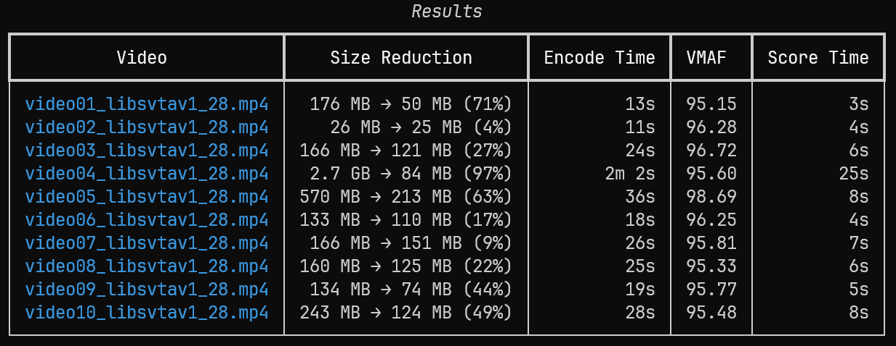

# ffvm

A CLI tool for encoding videos with ffmpeg and scoring quality with VMAF. Supports single files, batch processing, and automatic CRF sweeping to hit a target VMAF score.



## Installation

Requires [ffmpeg](https://ffmpeg.org/) (built with libvmaf) and ffprobe in PATH.

```
pip install ffvm
```

## Commands

### encode

Encode a single video file.

```
ffvm encode input.mp4 output.mp4 --vcodec libsvtav1 --crf 28 --preset 5 --extra "-svtav1-params tune=0:enable-qm=1:qm-min=0" --extra "-write_tmcd 0"
```

Options:
- `--vcodec` — Video codec: `copy`, `libx264`, `libx265`, `libsvtav1`, `libvpx-vp9`, `libaom-av1`, `librav1e` (default: `libx264`)
- `--crf` — Constant Rate Factor (default: `23`)
- `--preset` — Encoder preset, e.g. `5`
- `--extra` — Extra ffmpeg arguments (repeatable), e.g. `--extra "-svtav1-params tune=0"`
- `--acodec` — Audio codec: `copy`, `aac`, `libopus`, `libvorbis`, `flac`, `pcm_s16le`, `libmp3lame` (default: `copy`)
- `--ab` — Audio bitrate, e.g. `160k`
- `--resolution` — Output resolution, e.g. `1920x1080`
- `--compare` — Run VMAF comparison after encoding

### batch

Encode all videos in a directory.

```
ffvm batch ./videos --vcodec libsvtav1 --crf 30 --compare
```

Output files are named `{original}_{codec}_{crf}.{ext}`. Additional options:
- `--output-dir` — Write encoded files to a different directory
- `--recursive` — Search subdirectories for videos
- `--overwrite` — Skip overwrite confirmations
- `--compare` — Run VMAF on each encode and display a results table

### sweep

Find the optimal CRF for a video using binary search against a VMAF target. Extracts representative segments, tests CRF values, and encodes the full video at the best CRF found.

```
ffvm sweep input.mp4 output.mp4 --target-vmaf 95.0 --crf-min 20 --crf-max 35
```

Options:
- `--target-vmaf` — Target VMAF score (default: `93.0`)
- `--crf-min` — Lower bound of CRF search range (default: `23`)
- `--crf-max` — Upper bound of CRF search range (default: `32`)

### batch-sweep

Run CRF sweep on every video in a directory. Each video gets its own optimal CRF.

```
ffvm batch-sweep ./videos --vcodec libsvtav1 --target-vmaf 95.0
```

## How sweep works

1. Extracts 1-7 short segments (scaled by video length) from the middle 80% of the video
2. Binary searches through the CRF range, encoding and VMAF-scoring each segment per iteration
3. Converges when `crf_max - crf_min <= 1`
4. Encodes the full video at the resulting CRF

## Roadmap

- [ ] RAM disk support for intermediate files
- [x] Test suite (unit tests for pure functions, integration tests for encode pipeline)
- [x] Better error handling for ffmpeg subprocess failures
- [ ] Robust VMAF score parsing
- [ ] Logging for long-running operations (sweep, batch)
- [x] UI improvements (progress display, summary tables)
